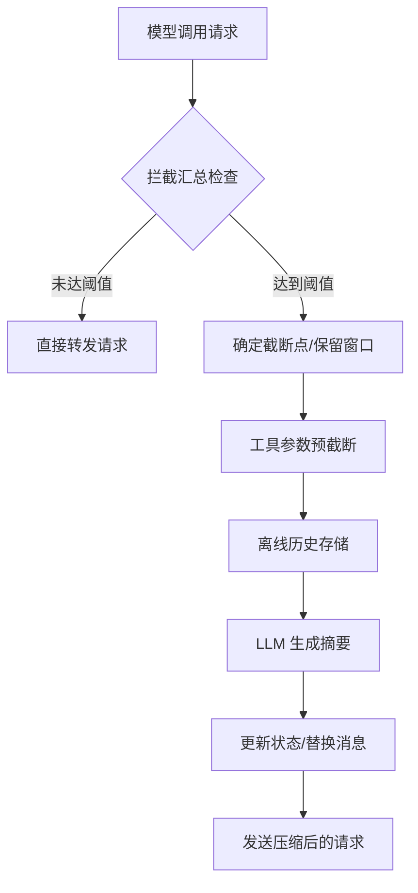

# 会话摘要与压缩技术手册 (核心实现版)

本文档基于 `summary_source.py` 和 `summarization.py` 的源代码实现，详细描述了会话摘要与压缩系统的技术机制。该系统通过中间件 (Middleware) 模式，在模型调用前自动拦截并压缩上下文，以平衡 Token 成本与信息保留。

## 1. 高层架构流程

系统采用中间件拦截机制，在 `before_model` 或 `wrap_model_call` 阶段执行。

---

## 2. 详细步骤细节分析

### 步骤 1：触发机制 (Triggering)
**实现位置：** `SummarizationMiddleware._should_summarize`
**逻辑：**
系统支持多种触发条件，只要满足其一即触发压缩：
- **基于消息数：** `len(messages) >= trigger_value`
- **基于绝对 Token 数：** `total_tokens >= trigger_value`
- **基于模型比例 (Fraction)：** `total_tokens >= (model.profile.max_input_tokens * value)`。此功能依赖于模型 Profile 配置。

### 步骤 2：确定截断点/保留窗口 (Cutoff Determination)
**实现位置：** `SummarizationMiddleware._determine_cutoff_index`
**算法细节：**

#### A. 截断计算
- **消息数策略：** 直接计算 `len(messages) - keep_value`。
- **Token 策略 (核心算法)：**
    1. **二分查找 (Binary Search)**：在消息列表中寻找一个最小索引 $i$，使得从 $i$ 到结尾的消息总 Token 数 $\le$ 目标保留数。
    2. 这种方法比线性扫描效率更高，能快速在长会话中定位精确的 Token 边界。

#### B. AI/Tool 消息对保护 (`_find_safe_cutoff_point`)
为了防止截断导致 `ToolMessage` 失去了对应的 `AIMessage` 调用，系统执行安全校准：
1. 如果截断点落在 `ToolMessage` 上，系统会向后扫描所有连续的工具响应。
2. 收集所有相关的 `tool_call_id`。
3. **向后回溯**搜索原始的 `AIMessage`（包含这些 `tool_call_id` 的消息）。
4. 将截断点**向前移动**至该 `AIMessage` 之前，确保调用与响应始终成对保留。

### 步骤 3：工具参数截断 (`_truncate_args`)
**实现位置：** `_DeepAgentsSummarizationMiddleware._truncate_args`
**逻辑：**
在执行全量摘要前，对旧消息中的冗长工具参数进行轻量化处理，以减少摘要 LLM 的输入压力：
- **目标工具：** 仅针对 `write_file` 和 `edit_file`。
- **截断阈值：** 字符长度 $> 2000$。
- **处理方式：** 保留前 20 个字符，后接 `"...(argument truncated)"`。
- **作用范围：** 仅处理处于 `keep` 窗口之外的消息。

### 步骤 4：离线历史存储 (Offloading)
**实现位置：** `_DeepAgentsSummarizationMiddleware._offload_to_backend`
**逻辑：**
在消息被替换为摘要之前，将其永久化存储到后端：
1. **路径生成：** 使用 `/conversation_history/{thread_id}.md`。
2. **内容构建：** 记录当前 UTC 时间戳，并将被剔除的消息流转换为 Markdown 文本。
3. **存储策略：** 采用 **追加模式 (Append-only)**，每次摘要事件在文件中增加一个新章节，形成完整的历史审计链。
4. **去重：** 过滤掉之前已存在的摘要消息 (`lc_source == "summarization"`)，防止递归存储摘要。

### 步骤 5：LLM 摘要生成
**实现位置：** `SummarizationMiddleware._create_summary`
**逻辑：**
1. **输入预处理 (`_trim_messages_for_summary`)**：
    - 使用 `trim_messages` 确保输入量不超过 `_DEFAULT_TRIM_TOKEN_LIMIT` (4000 tokens)，采用 `last` 策略（保留剔除块中最接近现在的部分）。
2. **提示词工程**：使用 `DEFAULT_SUMMARY_PROMPT`，要求 LLM 严格按照 `SESSION INTENT` $\rightarrow$ `SUMMARY` $\rightarrow$ `ARTIFACTS` $\rightarrow$ `NEXT STEPS` 的结构输出。
3. **结果处理**：去除首尾空白，将其包装为一条带有 `lc_source: summarization` 标记的 `HumanMessage`。

---

## 3. 算法总结表

| 功能模块 | 核心算法/实现方式 | 解决的关键问题 |
| :--- | :--- | :--- |
| **触发决策** | 阈值比较 | 高效决定是否需要启动压缩流程 |
| **截断定位** | **二分查找 (Binary Search)** | 在 Token 预算内最大化保留最近上下文 |
| **逻辑完整性** | **向后 ID 扫描 (Backward Scan)** | 防止截断导致工具响应失去调用上下文 (Orphaned Tool Messages) |
| **持久化** | **Markdown 追加存储 (Offloading)** | 在压缩上下文的同时提供可追溯的完整历史档案 |
| **输入优化** | `trim_messages` (LSTR) | 保证摘要生成请求不会因为输入过长而触发 `ContextOverflowError` |
| **架构模式** | **中间件拦截 (`AgentMiddleware`)** | 实现对业务逻辑透明的自动上下文管理 |
